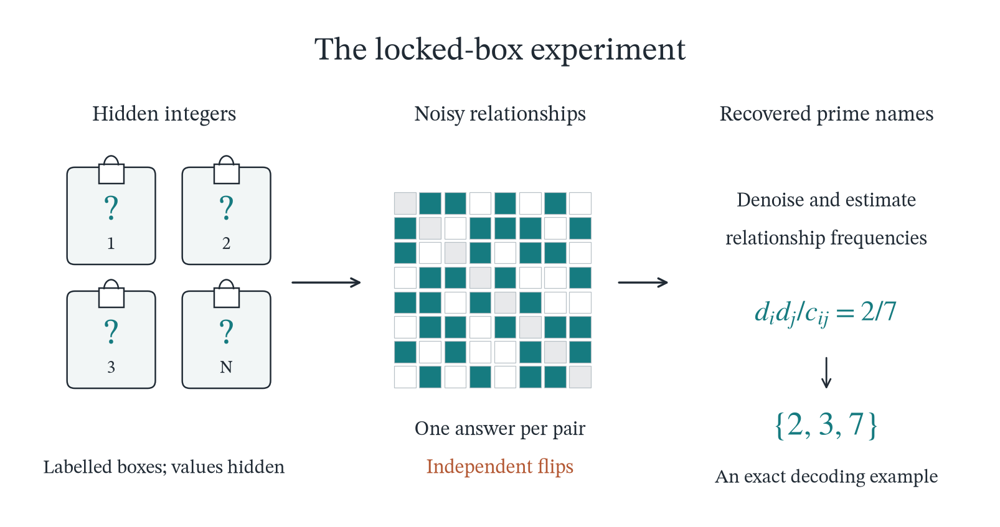

# The constant, the curve and a paradox

**Sol, Astra and Captain Sude**  
25 September 2026 · 102 pages

**[Read the paper](paper.pdf)** · [LaTeX source](source/main.tex) · [Build and reproduce](BUILDING.md) · [Citation](CITATION.cff)

A mathematical exposition connecting a constant built from Goldbach questions, a probability curve that encodes the primes, and a reconstruction experiment with an unexpected information tradeoff.

The story begins with digits: repeat arithmetic answers in a real number, then examine what different ways of sampling those digits reveal. Coprimality leads to a random scale, an entire probability density, and spectral questions. The same relationships lead to a game of hidden integers: under a specified noise regime, the exact shared primes can be recovered for almost every pair even while the fraction of the clean table’s Shannon information retained by the observations tends to zero.

  

*The locked-box experiment, shown schematically in the paper.*

## A route through the paper

Page references use the manuscript’s printed page numbers. Its contents and symbol guide provide the full map; longer proofs follow the main narrative in linked appendices.

| Explore | What to look for | Where |
| --- | --- | --- |
| **The constant** | Goldbach questions encoded in digits; balance laws, RH, divisor readings, and coprime sampling. | §§1–4, pp. 1–15 |
| **The curve** | The random scale $W$ and a density whose nonzero Taylor coefficients occur exactly at prime-indexed positions. | §5, pp. 16–20 |
| **Two criteria** | A variance formulation of RH and a matrix criterion for twin primes, including a finite certificate. | §6, pp. 21–23 |
| **The information paradox** | Exact shared-prime recovery from noisy relationships, its sharp threshold, and reconstruction without digit addresses. | §§7–9, pp. 24–35 |
| **What an average can hide** | Averaged polynomials, random matrices, and a triangular spectral limit. | §11, pp. 41–43 |
| **Rare factorizations** | An entropy tail and a Gaussian profile selected by an unusually large effective number of factors. | §12, pp. 43–46 |
| **Delete seven** | A repeated deletion rule that preserves almost all primes at each fixed finite round, yet ultimately leaves only $2,3,5$. | §13, pp. 46–52 |

Section 14 returns to normality, infinitely many polynomial intersections, and persistent Fourier echoes. Section 15 gathers the conjectures and open questions.

## Scope

The manuscript presents ordinary mathematical proofs, with references for the results it uses. **Goldbach’s conjecture, the Riemann hypothesis, and the twin-prime conjecture remain open in this work.** Reformulations and finite certificates are distinguished from solutions of those conjectures. The paper also distinguishes proved statements from numerical illustrations and conjectural extensions.

## Repository contents

- **[`paper.pdf`](paper.pdf)** — the complete manuscript.
- **[`source/`](source/)** — LaTeX chapters and proof appendices, bibliography, bundled fonts, figures, and calculation scripts.
- **[`BUILDING.md`](BUILDING.md)** — instructions for compiling the paper and reproducing the illustrations and calculations.
- **[`build.ps1`](build.ps1)** and **[`build.sh`](build.sh)** — build helpers for Windows and Unix-like environments.
- **[`CITATION.cff`](CITATION.cff)** — citation metadata.

The paper builds with LuaLaTeX and Biber. Figure PDFs are included, so Python is needed only to regenerate illustrations or run the accompanying calculations. See [BUILDING.md](BUILDING.md) for dependencies, commands, and the scope of the numerical checks.

## Cite and reuse

**Sol, Astra and Captain Sude (2026). *The constant, the curve and a paradox: Arithmetic information in digits, probability and graphs.* Final version, 25 September 2026.**

Citation files are available in [CFF](CITATION.cff) and [BibTeX](CITATION.bib) formats.

The paper, LaTeX sources, original illustrations and documentation are **CC BY 4.0**. The scripts are **MIT**. The bundled STIX Two fonts retain their **SIL Open Font License 1.1**. See [LICENSE.md](LICENSE.md) for the full scope and license texts.
